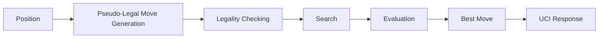

# Zugblitz

Zugblitz is a UCI-compatible chess engine written in C11.

## Why?

I started this project after watching Rey Enigma’s video about the match between Deep Blue and Garry Kasparov. Even though I barely understood what was happening due to my limited knowledge of chess, I became curious about how modern chess engines like Stockfish work, and how a computer outperforms its creators in a game requiring creativity and tactical knowledge.

Along the way, I learned a lot, and after countless hours debugging perft, I can confidently say that I no longer miss en passant captures.

## Features

* **Full move generation**: en passant, castling, promotions
* **Search algorithms**: Alpha-Beta, PVS, quiescence search, null-move pruning
* **Move ordering heuristics**: killer moves, history heuristics
* **Evaluation**: incremental midgame/endgame evaluation with PSQTs tuned via Texel’s method (see [Zugblitz Texel's tuning pipeline](https://github.com/P1X3R/texel_zugblitz))
* **Optimizations**: transposition tables, Zobrist hashing, LTO for release builds

## Architecture



The engine generates pseudo-legal moves, filters illegal ones through king-safety checks, searches the resulting game tree, evaluates leaf positions, and returns the best move through the UCI interface.

## Results

### Strength

Zugblitz plays at **~2200 Elo** at time control 2'+1" (blitz) according to the. See more details in [CCRL](https://computerchess.org.uk/404/cgi/engine_details.cgi?print=Details&each_game=1&eng=Zugblitz%201.3.2%2064-bit#Zugblitz_1_3_2_64-bit).

### Speed

| Benchmark             | N/s           |
| --------------------- | ------------- |
| Perft (no hash)       | 14.7M - 15.5M |
| Search (32MB TT size) | ~4.7M         |

* **CPU:** Intel Pentium Silver N5030
* **RAM:** 4GB DDR4

## Building

Requirements:

* Make
* C11-compatible compiler (clang is the default in the makefile)

```sh
make CC=gcc MODE=release
```

This will build a release-optimized binary for your **specific** platform.

> [!WARNING]
> `debug` mode doesn't work with MinGW due to sanitizers.

## Interesting Challenges

### Legal Move Debugging

A significant portion of the project was spent debugging legal move generation. The search quickly finds weird edge cases where the move generator fails; therefore, it is critical to have a highly reliable legal move generator in order to maintain playing strength. This is achieved through Perft, the de facto standard test for finding bugs in move generators.

### Testing Methodologies

As stated in the previous point, testing is even more important to ensure correctness in a chess engine's source code, and this remains true beyond legal moves. Initially, I wasn't really testing features, so I was building buggy features upon buggy features. Consequently, previous prototypes were significantly weaker even though they had more features.

This continued until the project began using SPRT to test every feature by running matches against a previous version of itself and seeing whether it's actually stronger or weaker.

### Evaluation Tuning

Evaluation parameters (PSQTs) are fine-tuned through Texel's tuning method. However, traditional stochastic hill climbing is very slow, especially given my machine's hardware constraints, so I decided to use a gradient-based approach with PyTorch in [Zugblitz Texel's tuning pipeline](https://www.github.com/P1X3R/texel_zugblitz).

## Previous Prototypes

* [Tanathos](https://www.github.com/P1X3R/tanathos)
* [Sand](https://www.github.com/P1X3R/sand)

## License

This project is licensed under the MIT License. See the LICENSE file for details.
